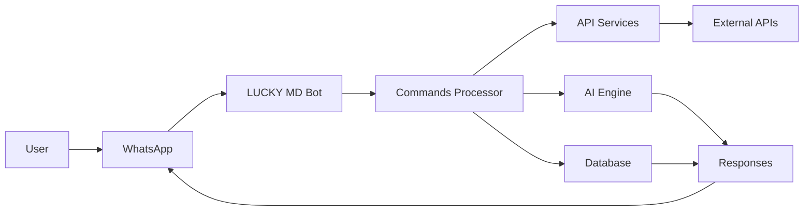

🤖 LUCKY MD XFORCE - Advanced WhatsApp Bot

https://raw.githubusercontent.com/mr-X-force/LUCKY-MD-XFORCE/main/media/lucky.svg

<div align="center">

https://img.shields.io/github/stars/mr-X-force/LUCKY-MD-XFORCE?style=for-the-badge&logo=github&color=yellow
https://img.shields.io/github/forks/mr-X-force/LUCKY-MD-XFORCE?style=for-the-badge&logo=github&color=green
https://img.shields.io/github/issues/mr-X-force/LUCKY-MD-XFORCE?style=for-the-badge&logo=github&color=red
https://img.shields.io/github/license/mr-X-force/LUCKY-MD-XFORCE?style=for-the-badge&logo=opensourceinitiative&color=blue
https://img.shields.io/badge/Version-5.0.9-success?style=for-the-badge&logo=git
https://img.shields.io/badge/Maintained%3F-Yes-brightgreen?style=for-the-badge

</div>

📊 GitHub Analytics Dashboard

<div align="center">

🏆 Developer Profile Stats

https://github-readme-stats.vercel.app/api?username=mr-X-force&show_icons=true&theme=radical&hide_border=true&count_private=true&include_all_commits=true
https://github-readme-stats.vercel.app/api/top-langs/?username=mr-X-force&layout=compact&theme=radical&hide_border=true
https://streak-stats.demolab.com/?user=mr-X-force&theme=radical&hide_border=true
https://activity-graph.herokuapp.com/graph?username=mr-X-force&theme=react-dark&hide_border=true&area=true

🏅 Achievement Trophies

https://github-profile-trophy.vercel.app/?username=mr-X-force&theme=onedark&no-frame=true&row=2&column=4&margin-w=15&margin-h=15

📈 Repository Stats

https://img.shields.io/github/repo-size/mr-X-force/LUCKY-MD-XFORCE?style=flat-square&label=Repo%20Size&color=informational
https://img.shields.io/github/last-commit/mr-X-force/LUCKY-MD-XFORCE?style=flat-square&label=Last%20Update&color=important
https://img.shields.io/tokei/lines/github/mr-X-force/LUCKY-MD-XFORCE?style=flat-square&label=Total%20Lines&color=success
https://img.shields.io/github/languages/count/mr-X-force/LUCKY-MD-XFORCE?style=flat-square&label=Languages&color=blueviolet

</div>

🚀 Quick Deploy Buttons

<div align="center">

One-Click Deploy Options

https://www.herokucdn.com/deploy/button.svg
https://railway.app/button.svg
https://www.koyeb.com/static/images/deploy/button.svg
https://render.com/images/deploy-to-render-button.svg
https://replit.com/badge/github/mr-X-force/LUCKY-MD-XFORCE
https://vercel.com/button

</div>

✨ Premium Features Matrix

<div align="center">

Category Features Status
🔒 Security Anti-call, Anti-delete, Anti-spam, Session Protection ✅ Active
🤖 Automation Auto-reply, Auto-status read, Auto-react, Auto-bio ✅ Enabled
🌐 Multi-Mode Public/Private modes, Group/DM features 🔄 Switchable
🎮 Entertainment Games, Sticker maker, Media tools, AI chat 🎯 50+ Commands
🛠️ Utility Downloader, Converter, Scanner, Tools 🔧 30+ Tools
📊 Analytics User tracking, Command stats, Usage analytics 📈 Real-time

</div>

📥 Quick Installation

Method 1: Direct Download

```bash
# Clone the repository
git clone https://github.com/mr-X-force/LUCKY-MD-XFORCE.git

# Navigate to directory
cd LUCKY-MD-XFORCE

# Install dependencies
npm install

# Start the bot
npm start
```

Method 2: Quick Setup Script

```bash
# One-line installer (Linux/Mac)
curl -sL https://raw.githubusercontent.com/mr-X-force/LUCKY-MD-XFORCE/main/install.sh | bash
```

Method 3: Docker Deployment

```bash
# Using Docker
docker pull frediai/lucky-md
docker run -d --name lucky-bot frediai/lucky-md
```

🎯 Getting Started Guide

Step 1: Get Your Session ID

https://img.shields.io/badge/GET_SESSION-Click_Here-blue?style=for-the-badge&logo=whatsapp

Step 2: Configure Environment

```env
SESSION_ID=your_session_id_here
PREFIX=!
OWNER_NUMBER=923xxxxxxxxx
MONGODB_URI=your_mongo_uri
AUTO_READ_STATUS=true
```

Step 3: Choose Deployment Platform

<details>
<summary><b>🖥️ Local Deployment</b></summary>

```bash
# Install Node.js 18+
# Install FFmpeg
# Install required libraries
# Configure .env file
# Run: node index.js
```

</details>

<details>
<summary><b>☁️ Cloud Deployment</b></summary>

1. Fork this repository
2. Choose a platform from buttons above
3. Add environment variables
4. Deploy and enjoy!

</details>

🛡️ Advanced Configuration

Environment Variables

```env
# Required
SESSION_ID=your_session_here
PREFIX=!

# Optional but recommended
MONGODB_URI=mongodb_url_for_database
OWNER_NUMBER=923xxxxxxxxx
AUTO_BIO=true
AUTO_STATUS_READ=true
ANTI_CALL=true
```

Bot Settings

```javascript
// Available configurations in config.js
{
    autoReply: true,
    antiDelete: true,
    autoReadStatus: true,
    autoBioUpdate: true,
    gameMode: true,
    stickerQuality: 'high',
    maxUploadSize: '100MB'
}
```

📱 Mobile Application

<div align="center">

https://img.shields.io/badge/Download-Fredi.AI_v2.9.9-APK-success?style=for-the-badge&logo=android
https://img.shields.io/badge/Direct_Download-➡️_Click_Here-blue?style=for-the-badge

📲 APK Features

· One-tap session creation
· Built-in QR scanner
· Real-time logs
· Mobile-optimized interface
· Auto-update system

</div>

🌐 Community & Support

<div align="center">

https://img.shields.io/badge/WhatsApp_Channel-Join_Now-25D366?style=for-the-badge&logo=whatsapp
https://img.shields.io/badge/GitHub_Discussions-Q&A-181717?style=for-the-badge&logo=github
https://img.shields.io/badge/Report_Issue-Bug_Report-critical?style=for-the-badge&logo=github
https://img.shields.io/badge/Request_Feature-💡_Suggest-blue?style=for-the-badge

</div>

📚 Documentation & Resources

Quick Links

· 📖 Full Documentation
· 🛠️ Command List
· 🚀 Deployment Guide
· 🔧 Troubleshooting
· 📝 Changelog

Video Tutorials

https://img.shields.io/badge/YouTube_Tutorials-Watch_Here-FF0000?style=for-the-badge&logo=youtube

🤝 Contributing

We love contributions! Here's how you can help:

1. Fork the repository
2. Create a feature branch (git checkout -b feature/AmazingFeature)
3. Commit your changes (git commit -m 'Add AmazingFeature')
4. Push to branch (git push origin feature/AmazingFeature)
5. Open a Pull Request

Contribution Badges

https://img.shields.io/github/contributors/mr-X-force/LUCKY-MD-XFORCE?style=flat-square&label=Contributors&color=green
https://img.shields.io/github/issues-pr/mr-X-force/LUCKY-MD-XFORCE?style=flat-square&label=Pull%20Requests&color=blue

📊 Project Insights



📞 Connect With Developer

<div align="center">

https://img.shields.io/badge/Facebook-FredieEzra-1877F2?style=for-the-badge&logo=facebook
https://img.shields.io/badge/Instagram-@frediezra-E4405F?style=for-the-badge&logo=instagram
https://img.shields.io/badge/YouTube-FrediAi_Tech-FF0000?style=for-the-badge&logo=youtube
https://img.shields.io/badge/GitHub-Fredi_AI-181717?style=for-the-badge&logo=github

</div>

🏆 Credits & Acknowledgments

Core Team

· Lead Developer: FREDI AI
· Contributors: All Contributors

Special Thanks

· WhatsApp Web API developers
· Open-source community
· Beta testers and users

Built With

https://img.shields.io/badge/Node.js-339933?style=flat-square&logo=nodedotjs&logoColor=white
https://img.shields.io/badge/JavaScript-F7DF1E?style=flat-square&logo=javascript&logoColor=black
https://img.shields.io/badge/MongoDB-47A248?style=flat-square&logo=mongodb&logoColor=white
https://img.shields.io/badge/Express.js-000000?style=flat-square&logo=express&logoColor=white

📜 License

This project is licensed under the MIT License - see the LICENSE file for details.

```
MIT License © 2024 FREDI AI
Permission is hereby granted, free of charge, to any person obtaining a copy...
```

⭐ Support Project

If you find this project helpful, please give it a star!

https://api.star-history.com/svg?repos=mr-X-force/LUCKY-MD-XFORCE&type=Timeline

---

<div align="center">

🌟 Star • 🍴 Fork • 👀 Watch • 🐛 Report Issues

Made with ❤️ by FREDI AI

Last Updated: $(date +%Y-%m-%d) | Version: 5.0.9

</div>